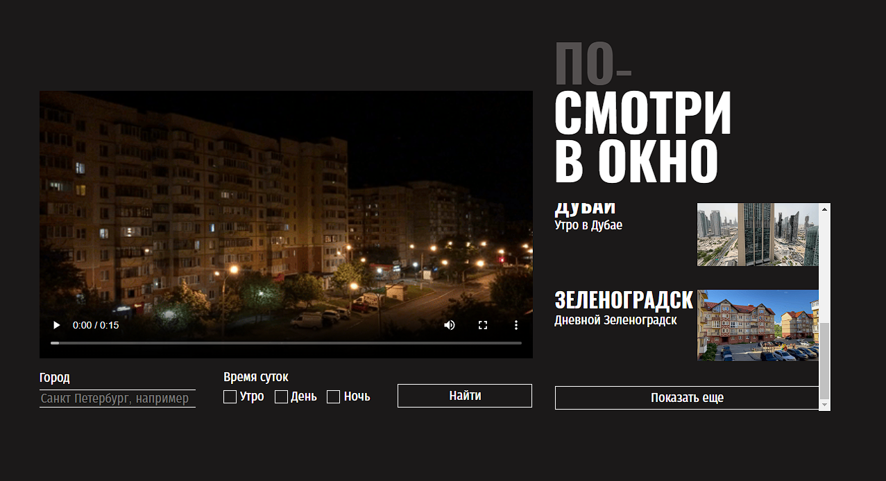

https://github.com/ggpwr/posmotri_v_okno

# Яндекс Практикум, практическая работа "Посмотри В Окно"

## Оглавление

- [Скриншот](#скриншот)
- [Описание](#описание)
- [Автор](#автор)
- [Благодарность](#благодарность)

### Скриншот

### Описание

Данное приложение позволяет "выглянуть" из окон самых разных городов мира.
Были решены задачи стилизации готовой вёрстки и отображения js-скрипта.

## Автор

- Github - [Евгений Кочетков](https://github.com/ggpwr)

## Благодарность

Благодарю команду Яндекс Практикум за предоставление дизайна и уроков!
